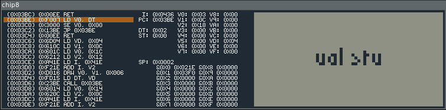

# Chip8 emulator



## Usage

You will need a Linux system, a C compiler and make.
```bash
make c8
```

To build the disassembler:
```bash
make d8
```

To run a rom:
```
LD_LIBRARY_PATH=$LD_LIBRARY_PATH:./raylib-2.5.0-Linux-amd64/lib/ ./c8 <roms_file>
```

## Acknowledgment

The inspiration for the UI is from https://massung.github.io/CHIP-8/, from which
I borrowed the font.
This chip8 emulator relied on [raylib](https://www.raylib.com/).
